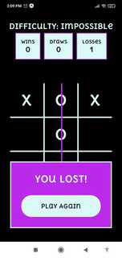

# Tic Tac Toe (TS)
it's an easy tic-tac-toe game with a small artificial intelisense where you play
against the computer, it has dificulty levels and settings, also a complete authentication system

I'm currently still working at the multiplayer game part

           

    

## Built with
- JavaScript
- React Native (with expo)
- Amplify (to use AWS)
- TypeScript
- GraphQl

## Author
### Cecilia Benitez
- 👤 [GitHub](https://github.com/Ceci007)

## Show your support
Give a ⭐️ if you like this project
